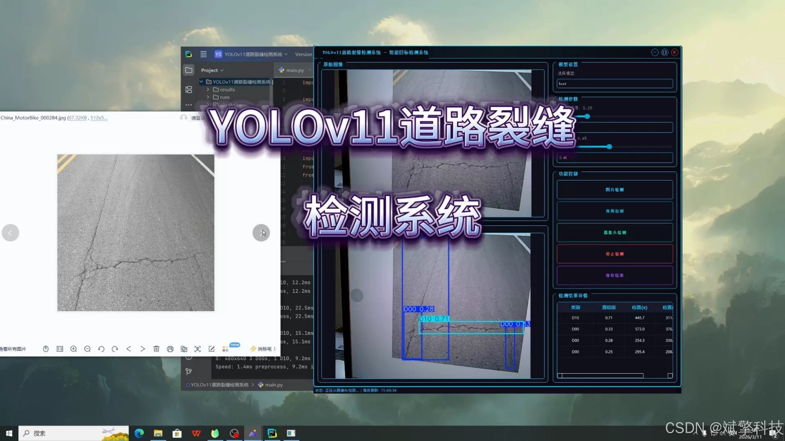
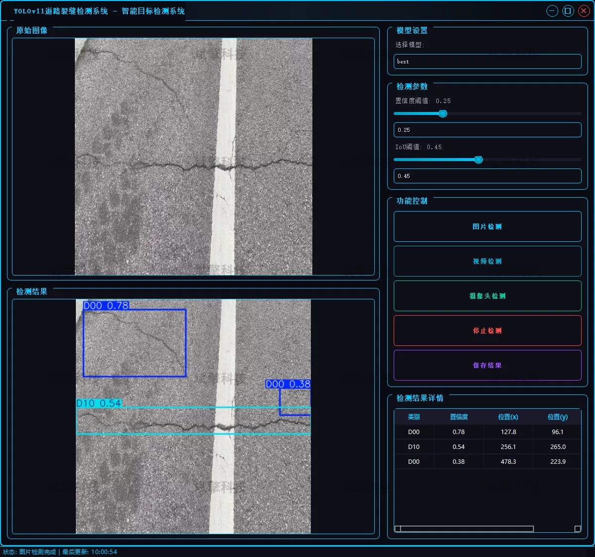
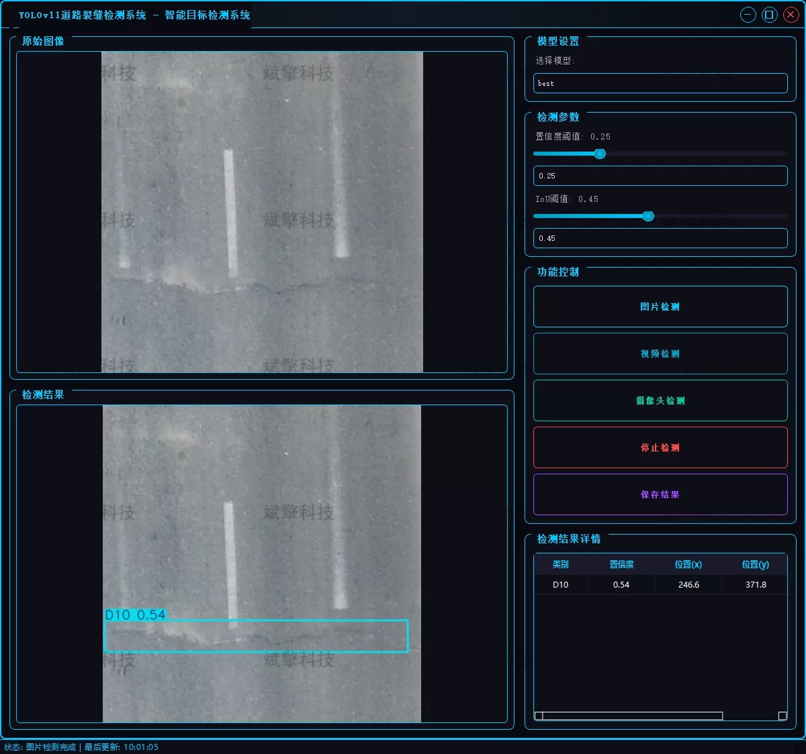
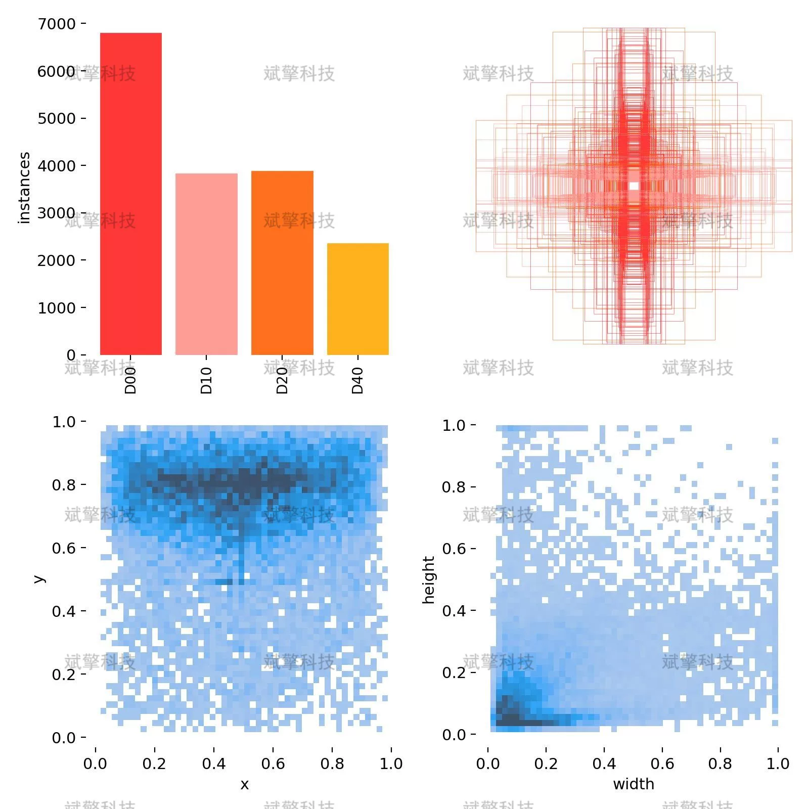
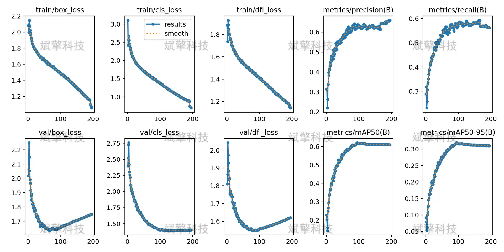
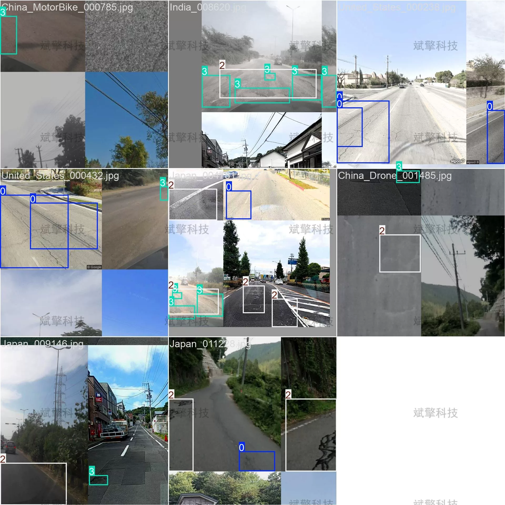
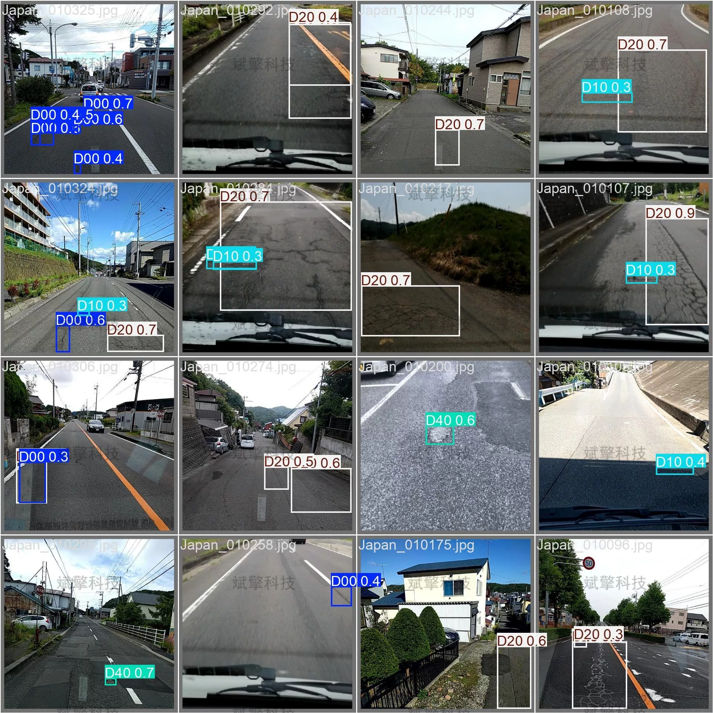

# YOLOv11 Road Crack Detection System

## Body

YOLOv11 Road Crack Detection System, based on the latest YOLOv11 deep learning target detection algorithm, has been designed and implemented to create an intelligent road crack detection system.
This system can efficiently process a variety of data sources including images, videos, and real-time camera streams. Through preprocessing and enhancement of collected road images, the improved YOLOv11 network model is used for deep feature extraction and recognition, achieving high-precision localization and classification of four common types of road surface cracks: transverse, longitudinal, blocky, and crinkled. Experimental results show that this system has high robustness and real-time performance in complex road backgrounds and lighting conditions.

Project Functionality Exhibition

✅ User Login and Registration: Supports password verification and security validation.

✅ Three Detection Modes: Based on the YOLOv11 model, supports image, video, and real-time camera detection, with precise target identification.

✅ Dual Screen Comparison: Displays the original scene and detection results on the same screen.

✅ Data Visualization: Real-time table displays the category, confidence, and coordinates of detected targets.

✅ Intelligent Parameter Tuning: Offers a confidence slide bar to dynamically optimize detection accuracy, meeting different scene needs.

✅ Sci-Fi Style Interactive Interface: Dark theme combined with dynamic light effects, reducing visual fatigue and improving operational experience.

✅ Multi-thread High-Performance Architecture: Independent detection threads ensure smooth operation, real-time status prompts, and fast response without lag.

Dataset Introduction

Training set: Includes 8,000 images.
Validation set: Includes 2,000 images.

## Images

## Payment

Here is a pay link on Stripe ( https://buy.stripe.com/3cs8yP7sY87d0vu9AB ). Please contact me lonlonago@foxmail.com after funding $89, and I will send you a complete data files , thank you!

